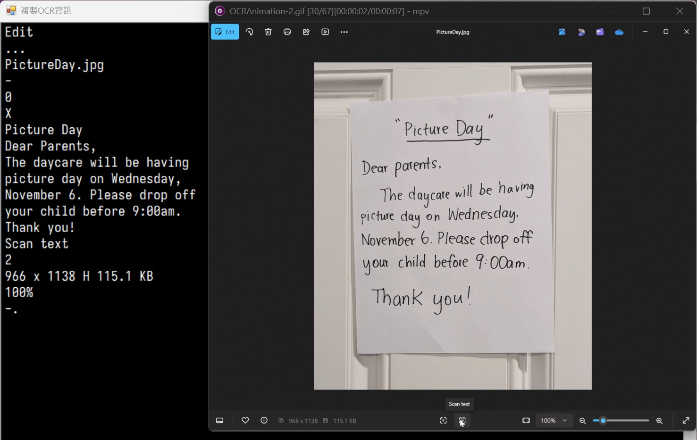

# mpv-win11-oneocr

mpv lua script based on [win11-oneocr](https://github.com/b1tg/win11-oneocr), key binding is ctrl+o

How to use:

The code depends on the DLLs and offline AI model, the easiest way is copy those files from SnippingTool folder, puts them in the same folder of mpv.exe

includes:

- oneocr.dll
- oneocr.onemodel
- onnxruntime.dll
